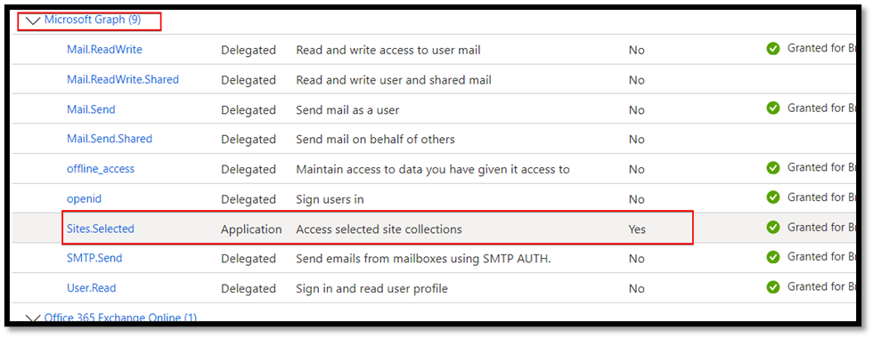
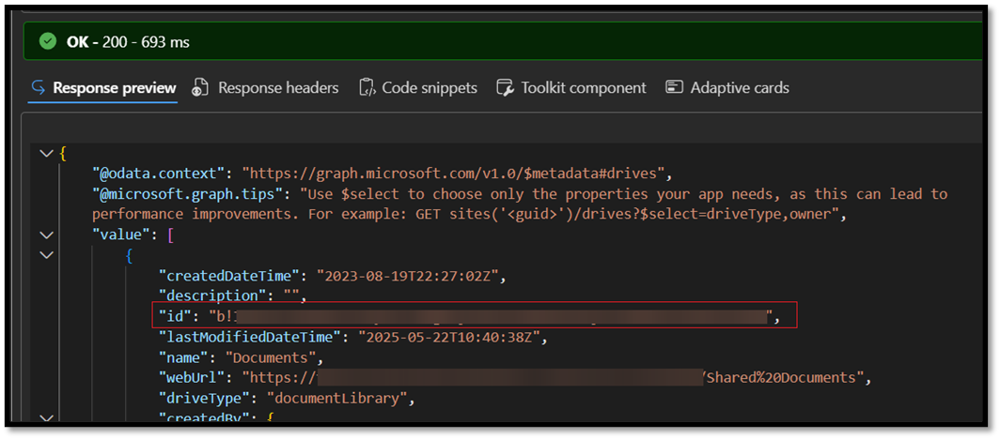
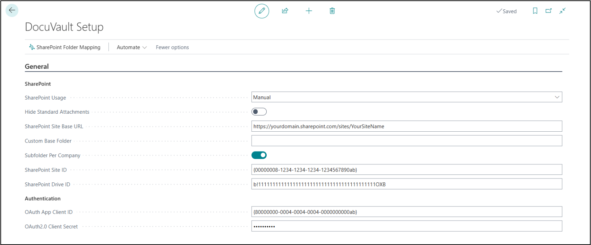
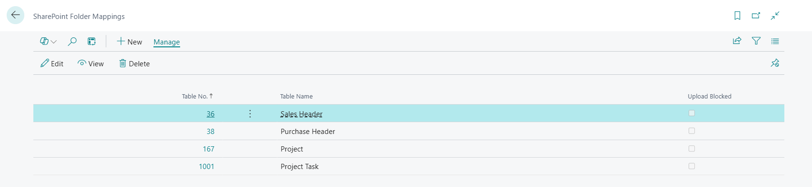
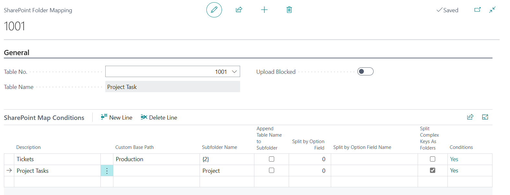
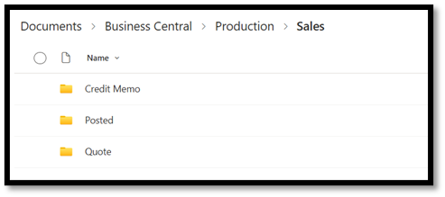
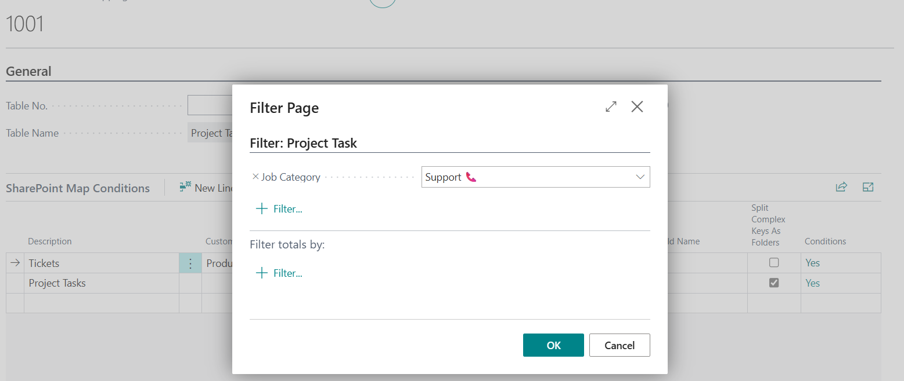
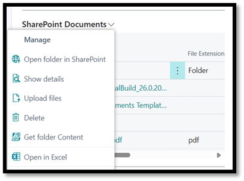
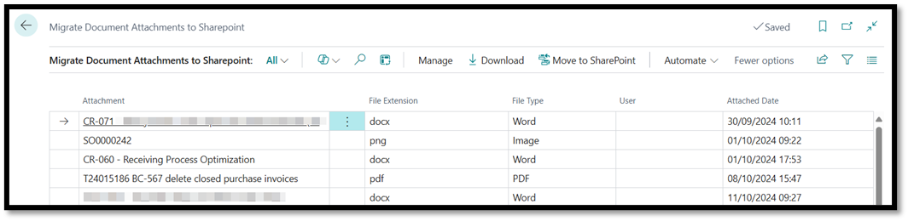

# Overview

The DocuVault extension for Microsoft Dynamics 365 Business Central is the SharePoint integration offering from Braintree.

The extension includes the following features:

- Maintain SharePoint links to any (physical) record in Business Central. Includes Standard Business Central, ISV or custom tables.
- Out-of-the-box, everywhere there the standard Business Central documents functionality was, there you will find DocuVault's SharePoint Documents factbox.
- Extensibility
- Migrate embedded attachments to SharePoint.
- Maintains links from quote through to Posted Documents and archived versions
- Upload multiple documents at a time

## Content
- [Setup and Configuration](#setup-and-configuration)
  - [Azure App Registration](#azure-app-registration)
  - [SharePoint Access](sharepoint-access)
  - [DocuVault Setup](docuvault-setup)
  - [Base- and Subfolders](base--and-subfolders)
  - [SharePoint Folder Mapping](sharepoint-folder-mapping)
    - [SharePoint Folder Mappings List](#sharepoint-folder-mappings-list)
  - [Extending the functionality](#extending-the-functionality)
- [SharePoint Documents factbox](#using-the-sharepoint-documents-factbox)
- [Migrate Document Attachments to SharePoint](#migrate-document-attachments-to-sharepoint)

<!-- # 2. Setup and Configuration -->

## Setup and Configuration

To start using DocuVault, some initial setup and configuration are required.

### Azure App Registration

You need to create an app registration in Azure with the Sites.Selected permission:
     

> **NOTE**: Use the **Client ID** and **Client Secret** in the DocuVault Setup

To find your SharePoint Site ID, you can follow these steps:

1. Navigate to your SharePoint site: Open your SharePoint site in your web browser.
2. Modify the URL: Add /_api/site/id at the end of your site's URL. For example, if your site URL is https://companyname.sharepoint.com/sites/sitename, you would modify it to https://companyname.sharepoint.com/sites/sitename/_api/site/id.
3. Press Enter: This will display the site information, including the Site ID, in a JSON format

> **NOTE**: Use the **Site ID** in the DocuVault Setup and the below queries.

### SharePoint Access

To find your SharePoint Drive ID and grant access to the App Registration in SharePoint:    
1. Go to: https://developer.microsoft.com/en-us/graph/graph-explorer , make sure to sign in before you do the next steps
2. Do a GET on https://graph.microsoft.com/v1.0/sites/{site-id}/permissions
3. Might prompt you to modify permissions. Grant Sites.FullControl.All
4. Then run POST on https://graph.microsoft.com/v1.0/sites/{site-id}/permissions
           with body:

           {
                "roles": ["write", "read"],
                "grantedToIdentities": [
                    {
                        "application": {
                            "id": "<your app registration client id>",
                            "displayName": "SharePoint Access"
                        }
                    }
                ]
            }
5. Run GET on https://graph.microsoft.com/v1.0/sites/{site-id}/drives

Find your id there:

 

> **NOTE**: Use the **Drive ID** in the DocuVault setup.

### DocuVault Setup
 

- SharePoint Usage: Specifies the value of the SharePoint Usage field. 
  - Manual: All SharePoint integration is strictly manual. 
  - Hybrid: The system will automatically upload to SharePoint when automated tasks upload to Document Attachments. 
  - Override: The system will override the default behavior and only use SharePoint as the default storage location and hide the standard Document Attachment factboxes.
- Hides Standard Attachments: Hides the standard BC Attachments factbox
- SharePoint Site Base URL: The base url to your SharePoint site
- Custom Base Folder: Overrides the default /Business Central/EnvironmentName and per company base path
- Subfolder Per Company: When using default path, creates a subfolder that includes the Company Name
- Site ID: Populate with id retrieved in section 2.1
- Drive ID: Populate with id retrieved in section 2.2
- Client ID: App id for the registration done in section 2.1
- OAuth2.0 Client Secret: The client secret for the registration done in section 2.1
 
>**NOTE**: The token is stored securely in the database and cannot be accessed externally and will not be used for anything other than the SharePoint integration.

### Base- and Subfolders
- In DocuVault is, you have a base folder wherein you organize all your documents. You then have subfolders per environment, company and type of entity.
- Base folder and subfolder fields are split to reduce the amount of manual setup required.
- The thinking was that it should *automatically* separate the documents for separate environments.
- The base folder exists in the Shared Documents of the specified site.
- The global default base folder is `/Business Central/<BC EnvironmentName>/` 
- The global default base folder can be overridden by the **Custom Base Folder** field in the DocuVault Setup.
- Further to this, the global default base folder can be overridden per folder mapping.

### SharePoint Folder Mapping
- If a document is uploaded for a table that is specified in the mapping setup, it will create a subfolder in the global base folder for that table using the table caption.
- Subfolders are appended to the base folder.
- Subfolders are created for each record using the primary key for that record. (Some special characters may have been removed)

>**NOTE**: If you make a copy of your Production Environment to Sandbox, existing links will still point to the Production folder, but new documents will be added to the Sandbox folder. 
Take care of file operations in Sandbox!

### SharePoint Folder Mappings List
Create a new entry for each table that you want to configure.
Then edit open the card page to edit the mapping conditions.

- **Upload Blocked**: Prevents a user from uploading documents for that table.
- **Description**: Non functional description intended for user to easily identify correct record.
- **Custom Base Path**: Overrides the global default and Custom Base Folder, still located within the same site's Shared Documents folder.
- **Subfolder Name**: Provide a custom folder name (can use a folder path) for a table. 
  - You can make use of placeholders. e.g. `{2}` will use the value in field 2 as the subfolder name. In the provided example, that would be the **Project Task No.** field value.
  - > Note: Using the Assist Edit button will append the selected field to the field value, and might overwrite the value if it wasn't committed at the time of clicking the button. It is suggested to select all the fields as required and then format the field afterwards.
- **Append Table Name to Subfolder**: Creates a subfolder in the parent folder with the Table Caption.
  - Example: If we had folder mappings for Customer and Vendor tables, with **Subfolder Name** set to Finance for both, and **Append Table Name to Subfolder** set to *Yes*, It will create Finance\Customer and Finance\Vendor folders.
- **Split by Option Field**: Creates subfolders per option value for the related record.
  - Example: When using **Document Type** field for Sales Header or Purchase Header table, it will create Quote, Order, Invoice, Credit Memo and Blanket Order subfolders.

    

  - **Split Complex Keys As Folders**: For each field in the primary key, it will create a subfolder. Example: Project Task record, Project No.=J001, Project Task No.=T0123, it will create a /J001/T0123 folder, instead of the J001-T0123 folder. 
- **Conditions**: Allows you to specify the conditions when it must use the current mapping configuration.
  - In the example, we store attachments for our tickets in a /Production/T0123/ folder. A ticket is a Project Task, and we differentiate it with a custom field, Job Category.
  - Regular project tasks, the condition filters on everything other than Support Job Category and they will be located, for example, in /Business Central/Production/Project/J001/T0123

  

> Note: **Append Table Name to Subfolder**, **Split by Option Field** and **Split Complex Keys As Folders** can be handled with propper setup in **Subfolder Name** using the placeholders. These fields will be removed in a future release. Please migrate setups to the **Subfolder Name** field in the meantime.

For Sales and Purchases, a document linked to a quote will follow the record through its lifecycle all the way to a posted document. It will also carry that link on to archived versions of the document.
But keep in mind that, the links will refer to the folder where the link was created. It does not move the files; it copies the links to the existing file. E.g. If you create a quote and upload files, then convert to an order and upload files and then post and upload files. You will have documents linked on your posted invoice that reside in the original quote, order and posted invoice folders.

### Extending the functionality
If required, we can assist you with extending your environment with SharePoint attachments, by adding the SharePoint factbox for custom tables or redirecting the default save location.

## Using the SharePoint Documents factbox
We will endeavour to keep up with standard Business Central and with each major version, update DocuVault to have the factbox added where there was a Documents attachment factbox.
  
 

- Open folder in SharePoint: Opens the folder in the browser. ()If the folder does not exist, you may get a 404 NOT FOUND error page). Folders are automatically created when files are uploaded.
- Show details: A list page for the attachments that allows you to rename files, view the credentials of the user that uploaded the files and the timestamp.
- Upload files: Displays a dialog that allows the user to upload documents. Multiple documents can be uploaded at a time.
- Delete: Delete the link to this record. If there are no more links to the file, the file is also deleted from SharePoint.
- Get folder Content: If the record was created retrospectively, i.e. there is a SharePoint folder for the record that will be reachable using the folder mapping and record naming conventions, or files have been added via a different interface, this feature can be used to link to those files to the record automatically.

## Migrate Document Attachments to SharePoint

Allows the user to move all embedded files to SharePoint. It will maintain record links where available. Orphaned files will be added to an orphaned folder so that the user can action them manually where and if needed. 

[**⬆️ Back to Top**](#content) &nbsp;&nbsp;&nbsp;&nbsp; [**🏠 Home**](/Braintree-theme)

<!-- 
# 5. Troubleshooting
If you encounter any issues or errors while using the DocuVault extension please contact Braintree support, providing details such as error messages and the steps leading to the problem for efficient troubleshooting.

Email: bcsupport@braintree.co.za -->